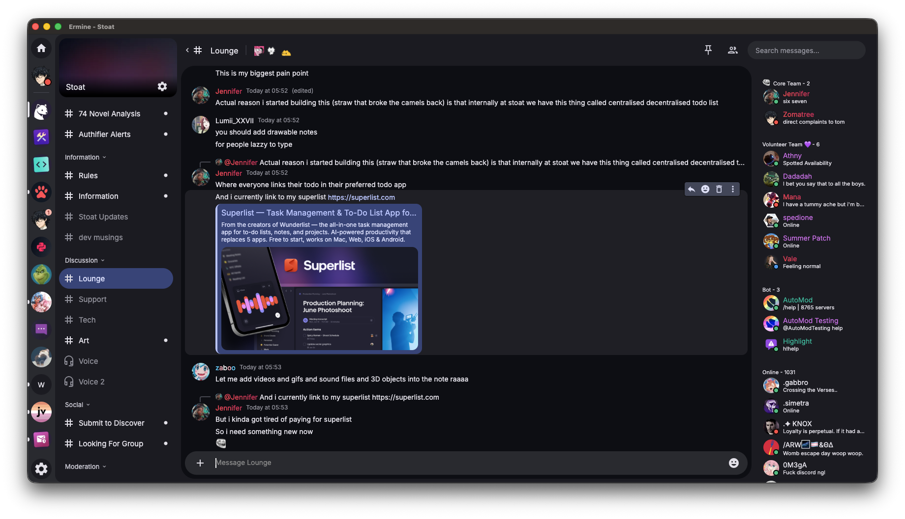

# Ermine

> ### This project has no affiliation with the official Stoat project or Revolt Platforms LTD.

Unofficial Stoat.chat client built on the Freya UI Framework.

Also styled after Material 3 UI.



## Downloading

Builds can be found from the [releases page](https://github.com/Zomatree/ermine/releases/latest).

## Running

Please ensure you have rust and the other necessities installed beforehand.

```bash
git clone https://github.com/zomatree/ermine
cd ermine
cargo run --release
```